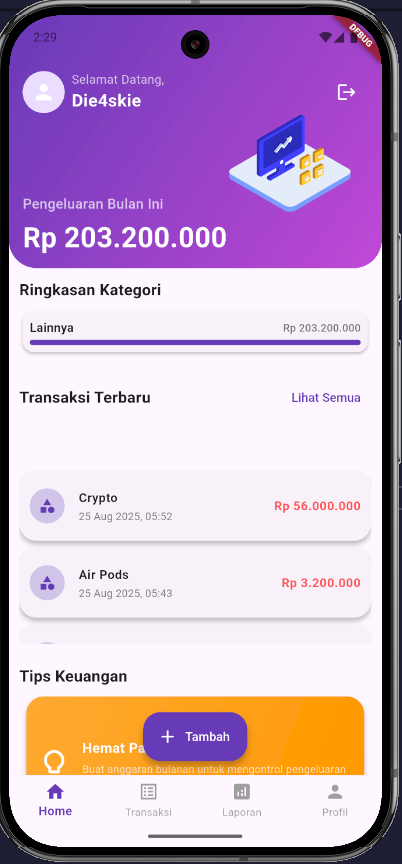
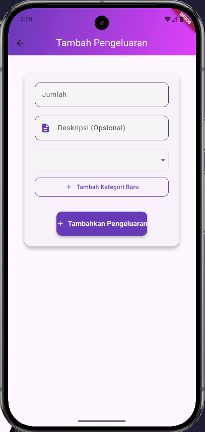
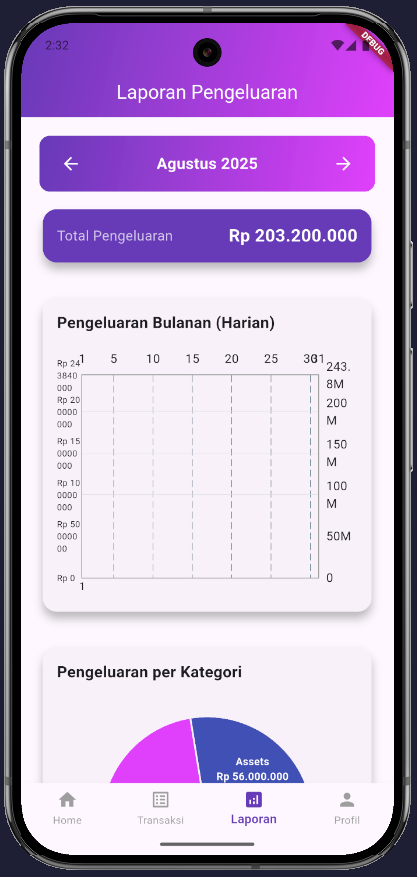
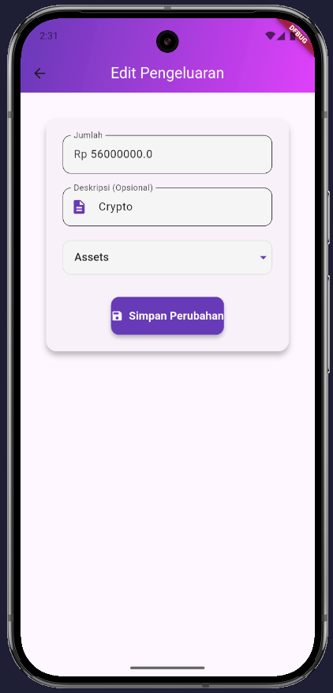
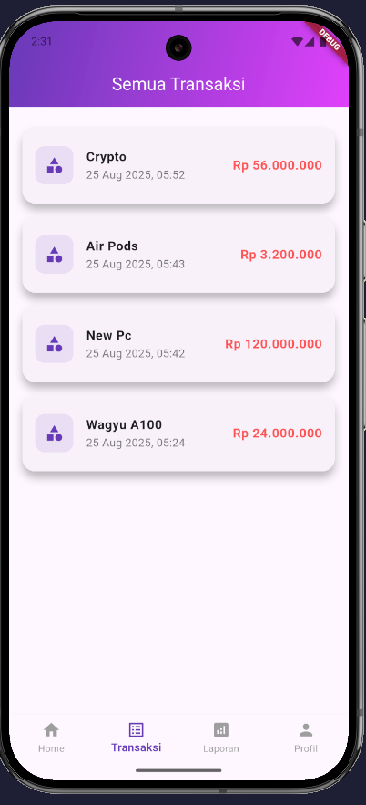
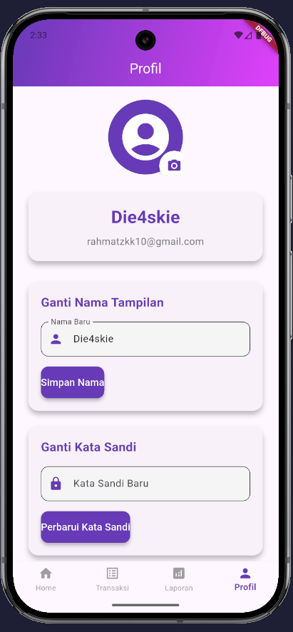

# 📱 Keuanganku

**Keuanganku** adalah aplikasi pelacak pengeluaran pribadi berbasis **Flutter** dengan backend **Supabase**.  
Tujuannya membantu pengguna mengelola keuangan sehari-hari dengan tampilan modern, responsif, dan mudah digunakan.

---

## 📸 Screenshot
<p align="center">
  
  
  
</p>
<p align="center">
  
  
  
</p>

---

## ✨ Fitur Utama
- 🔐 **Autentikasi Aman**  
  - Login & register via Email/Password atau Google (Supabase Auth).  
  - Navigasi otomatis sesuai status login.

- 📊 **Dashboard Modern**  
  - Ringkasan pengeluaran bulanan.  
  - Menampilkan 3 transaksi terbaru.  
  - Slider tips keuangan dinamis.  

- 📝 **Manajemen Transaksi (CRUD)**  
  - Tambah, edit, hapus, dan lihat semua pengeluaran.  
  - Swipe-to-delete & edit transaksi.  

- 📈 **Laporan & Visualisasi Data**  
  - Grafik garis → tren pengeluaran harian.  
  - Grafik pie → persentase kategori.  
  - Filter bulan dengan navigasi panah.  

- 👤 **Profil & Kategori**  
  - Ubah nama, kata sandi, dan foto profil.  
  - Tambah/hapus kategori pengeluaran.  

---

Berikut sudah saya rapikan penulisan Markdown-nya agar konsisten, rapi, dan enak dibaca:

````markdown
## 🚀 Cara Menjalankan Proyek

1. **Clone Repository**
   ```bash
   git clone https://github.com/skimatt/KeuanganKu.git
   cd KeuanganKu
````

2. **Install Dependencies**

   ```bash
   flutter pub get
   ```

3. **Setup Supabase**

   * Buka file `.env` (atau buat baru jika belum ada).
   * Tambahkan kode berikut dengan data dari Supabase Project:

     ```env
     SUPABASE_URL=https://xxxx.supabase.co
     SUPABASE_ANON_KEY=your-anon-key
     ```

4. **Jalankan Aplikasi**

   ```bash
   flutter run
   ```

---

## 🛠️ Teknologi yang Digunakan

* **Flutter** → Frontend & UI/UX
* **Supabase** → Auth, Database, Storage
* **StreamBuilder** → Real-time state pada autentikasi & dashboard

---

## 📖 Ringkasan

Proyek **Keuanganku** dirancang sebagai aplikasi mobile modern dengan:

* 🎨 **UI/UX estetik**
* ⚡ **Backend realtime yang kuat**
* ✅ **Fitur lengkap (auth, CRUD, laporan, profil)**

👉 **Cukup clone repo, atur file `.env`, lalu jalankan Flutter – aplikasi siap dipakai 🚀**

---

## made with 💖

## 📄 Lisensi

MIT License © 2025 **Rahmat Mulia**


